# 🚀 React Admin Dashboard  
### A Feature-Rich, Customizable Admin Panel  
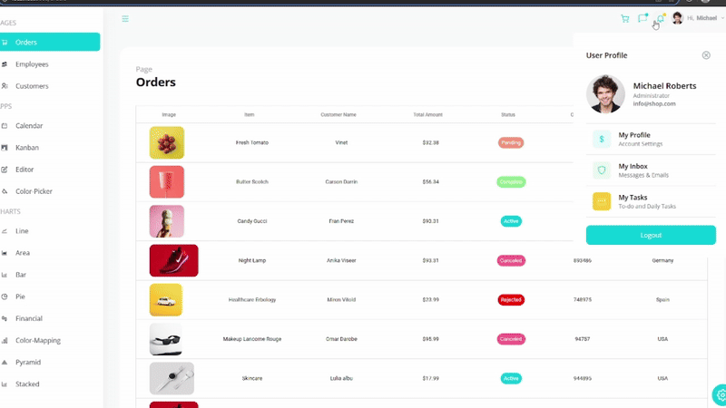
## 🌟 Overview  
This project is a full-featured **React Admin Dashboard** with theming, interactive tables, charts, calendar, and task management (Kanban). Built using modern technologies, it ensures **responsive design** and a smooth user experience.  

## 🔥 Features  
- 🎨 **Theming Support** – Customize UI effortlessly  
- 📊 **Data Visualization** – Beautiful, interactive charts  
- 📅 **Integrated Calendar** – Plan & organize events  
- 📝 **Kanban Board** – Task management made easy  
- 🔍 **Dynamic Tables** – Sort, filter & manipulate data  
- 🚀 **Fully Responsive** – Optimized for all devices  

## ⚙️ Tech Stack  
This project is powered by:  
- **React** – Component-based UI  
- **Material UI** – Stylish UI components  
- **Tailwind CSS** – Modern utility-first styling  
- **Craco** – Create React App config overrides  
- **Webpack** – Module bundling for enhanced performance  

## 🚀 Getting Started  
### Install Dependencies  
```bash
npm install
```
# 📸 Preview
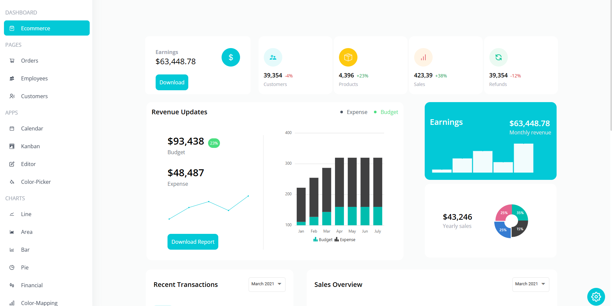
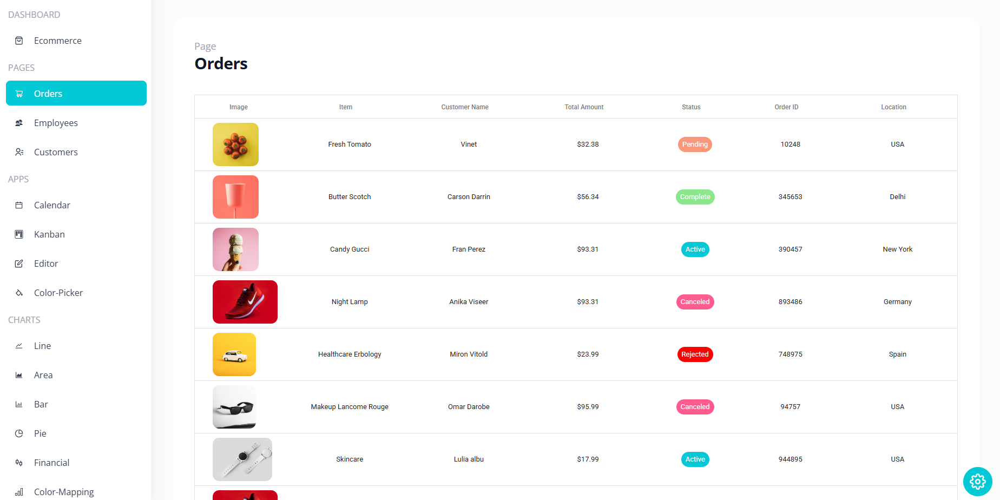
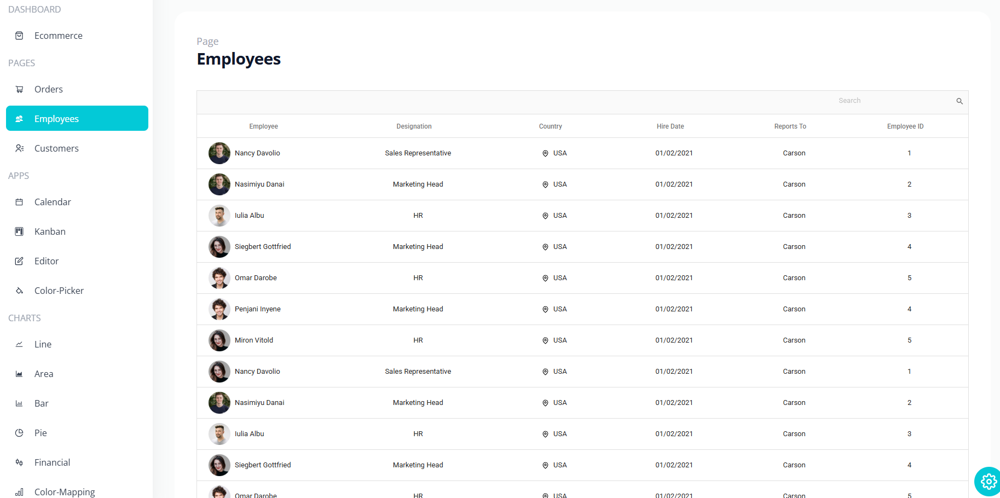
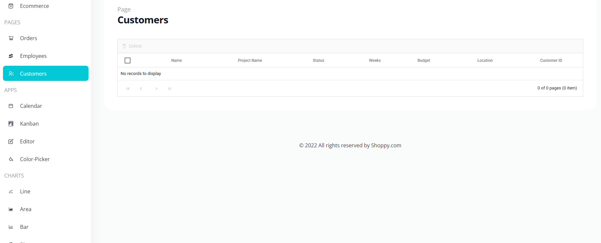
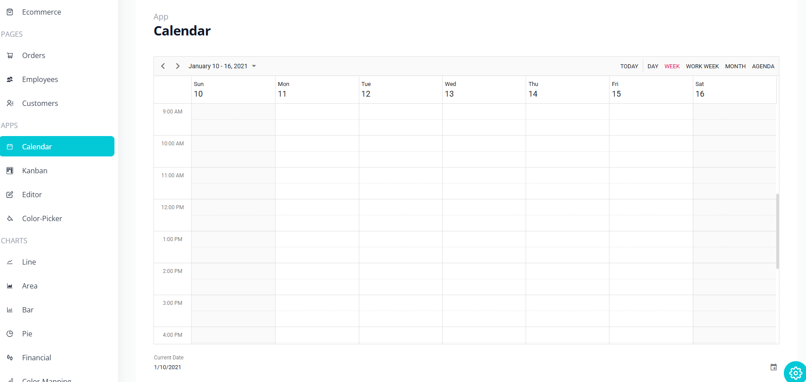

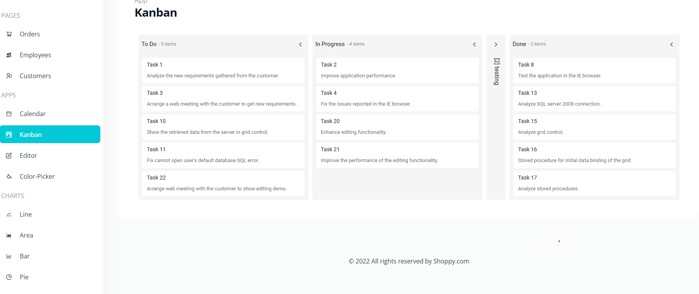
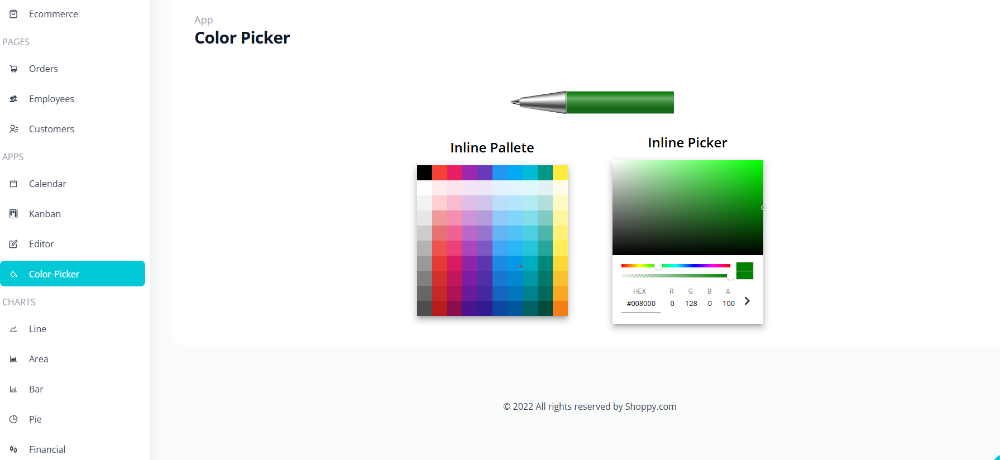
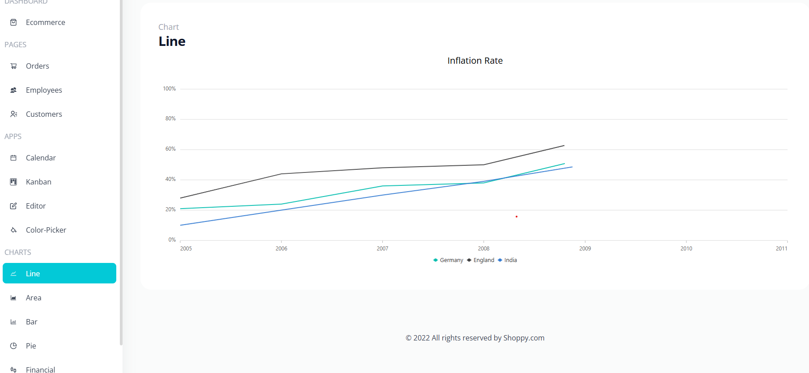
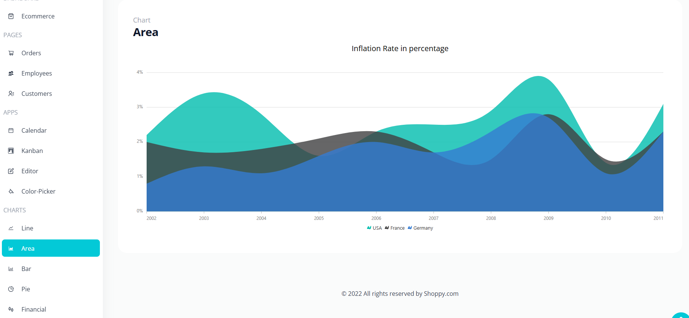
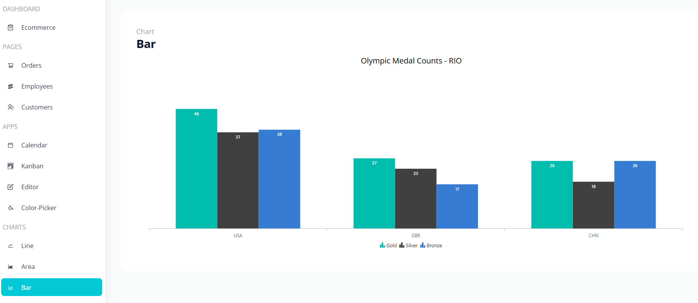
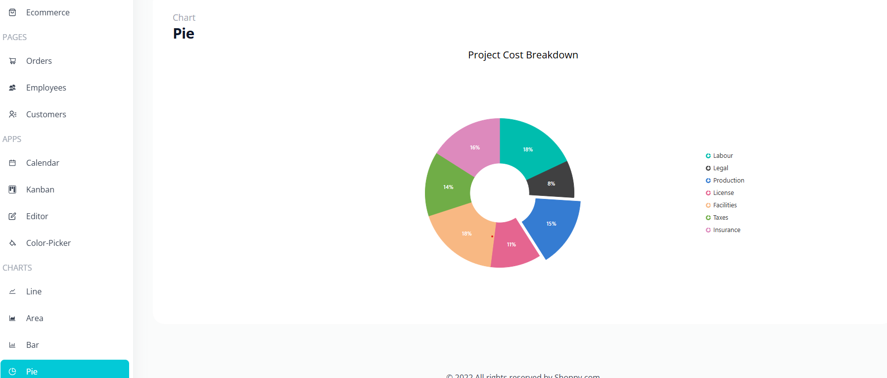
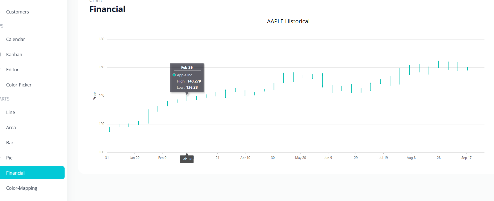
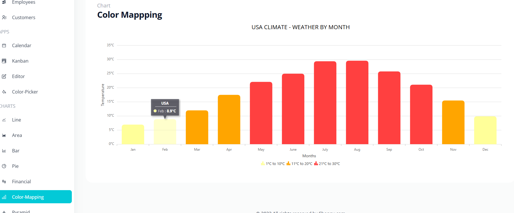
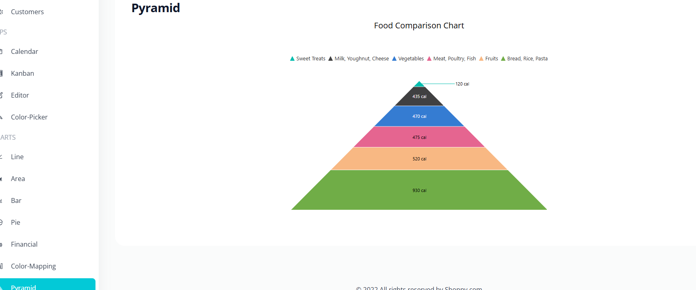
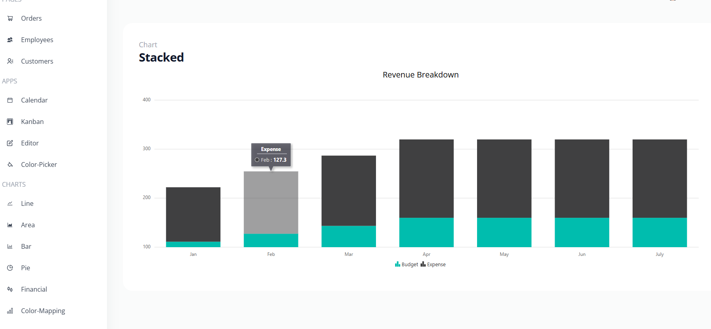

